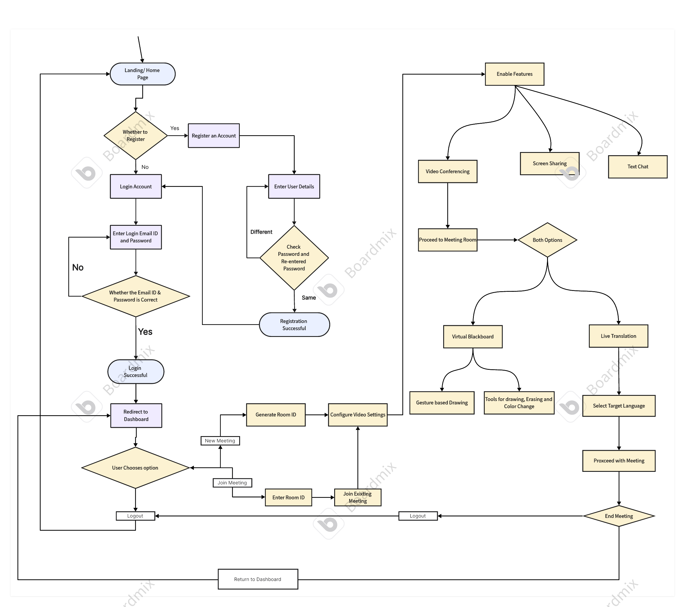
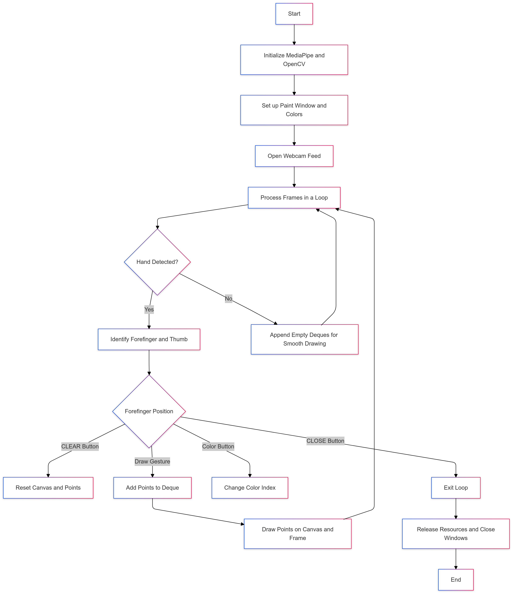

# LiveTransMeet: A virtual meeting application with real time speech to speech translation and virtual blackboard

LiveTransMeet is an innovative virtual meeting application that provides live multilingual speech-to-speech translation and a Virtual Blackboard feature, enabling seamless communication and collaboration across languages and geographies.

## Features

### 1. Live Multilingual Speech-to-Speech Translation
- **Real-time Translation:** Powered by Meta AI's seamless streaming pretrained model.
- **Languages Supported:** Translate between multiple languages for global collaboration.
- **Cloud Services:** Integrated with Hugging Face for scalable cloud deployment.

### 2. Virtual Blackboard (Air Canvas)
- **Gesture-based Interaction:** Utilize Mediapipe, OpenCV, and NumPy to enable air drawing.
- **Smooth Drawing Experience:** Create and share visuals during meetings in real-time.

### 3. WebRTC for Seamless Streaming
- **Real-Time Communication:** Built with Zegocloud for low-latency audio and video streaming.
- **High-Quality Streaming:** Ensures smooth communication and interaction.

## Technology Stack

### Frontend
- **HTML & CSS:** For intuitive and responsive UI design.

### Backend
- **Django:** Robust backend for handling application logic and APIs.

### Cloud Services
- **Hugging Face:** Used for hosting translation models.
- **Zegocloud:** Provides real-time WebRTC capabilities.

### Libraries & Tools
- **Python:** Core programming language.
- **Mediapipe, OpenCV, NumPy:** For implementing the Virtual Blackboard.

## Installation

1. Clone the repository:
   ```bash
   git clone https://github.com/Aditya-Manwatkar/LiveTransMeet.git
   cd LiveTransMeet
   ```

2. Set up a Python virtual environment:
   ```bash
   python -m venv env
   source env/bin/activate # On Windows: `env\Scripts\activate`
   ```

3. Install dependencies:
   ```bash
   pip install -r requirements.txt
   ```

4. Set up environment variables:
   - Create a `.env` file in the root directory.
   - Add API keys and credentials for Hugging Face and Zegocloud.

5. Run the development server:
   ```bash
   python manage.py runserver
   ```

6. Access the application at `http://127.0.0.1:8000/`.

## Usage

1. Launch the application and log in to your account.
2. Start or join a meeting.
3. Enable live translation for multilingual communication.
4. Use the Virtual Blackboard for interactive collaboration.

## User Navigation Flowchart



## Virtual Blackboard Workflow



## Contributing

We welcome contributions from the community! To contribute:
1. Fork the repository.
2. Create a new branch for your feature or bug fix.
3. Commit your changes and push to your fork.
4. Submit a pull request.

## License

This project is licensed under the [MIT License](LICENSE).

## Acknowledgments
We would like to express our deepest gratitude to the following contributors and organizations who made this project possible:
- **Meta AI:** For the seamless streaming pretrained model.
- **Zegocloud:** For providing WebRTC capabilities.
- **Hugging Face:** For cloud hosting services.
- **Open Source Libraries:** Special thanks to the contributors of Mediapipe, OpenCV, NumPy, and Django.
Your support and contributions have been instrumental in bringing LiveTransMeet to life. Thank you!
---

Start collaborating globally with LiveTransMeet today! 🌍
